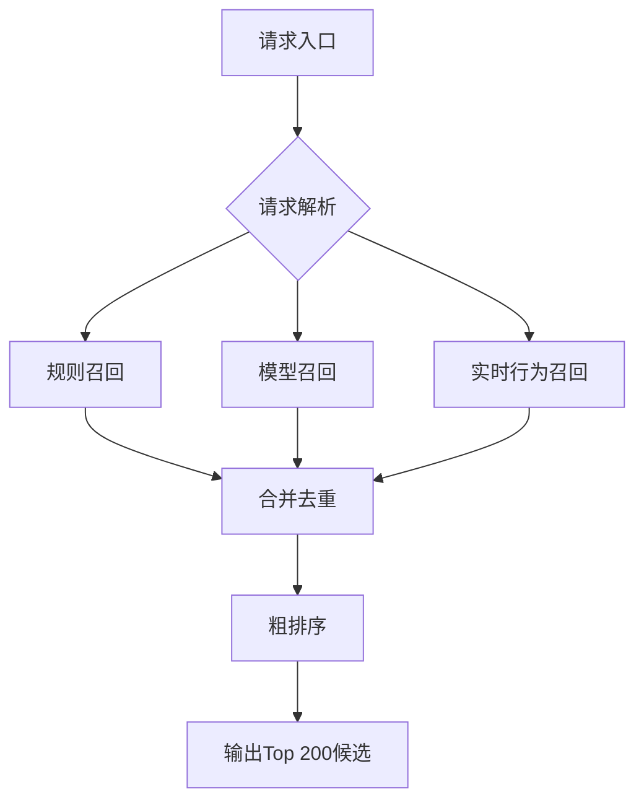

# blog
一个初入程序界的萌新，在大学期间没有养成写博客的习惯。刚进入实习阶段为了培养自己的能力，也为了避免自己重复踩坑，记录一下自己的学习历程和踩坑记录

## 目录

### [面试记录](interview)
- [校招记录](interview/school_recruitment)
- [社招记录](interview/social_recruitment)

### [技术总结](technical)
- [计算机基础知识](technical/计算机基础知识)
- [ElasticSearch](technical/elasticsearch)
- [Git](technical/git)
- [Golang](technical/golang)
- [Linux](technical/Linux)
- [MySQL](technical/mysql)
- [Nginx](technical/nginx)
- [Python](technical/python)
- [Redis](technical/redis)
- [其他](technical/其他)

### [其他爱好](hobby)
- [English](hobby/English)

